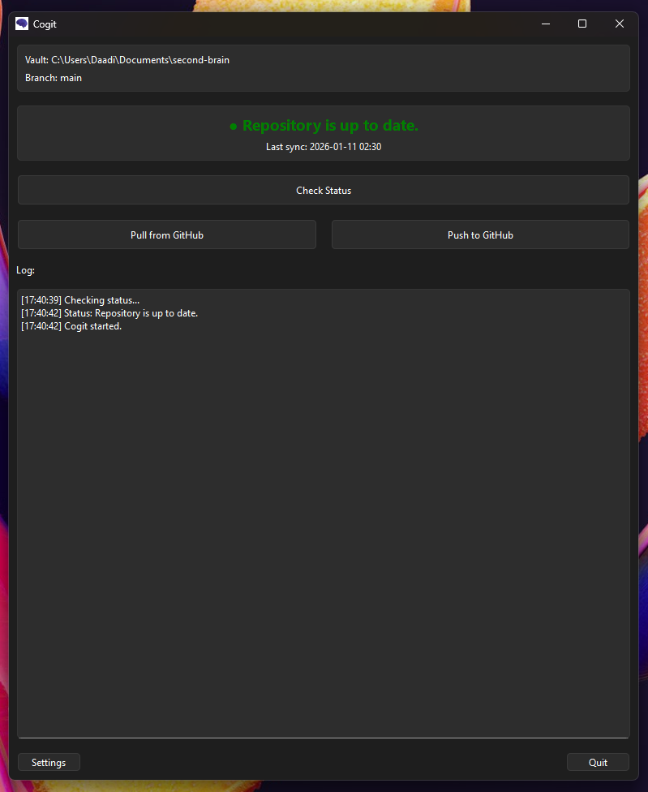

# Cogit

**C**ontinuous **O**bsidian **G**it **I**ncremental **T**racking V1

This is the first version of Cogit, it is a desktop utility designed to make backing up Obsidian vaults to GitHub safe, explicit, and stress-free. It provides a simple graphical interface to check repository status, pull changes, and push your work without needing to use the command line.


## Purpose

Cogit is designed to be:
*   **Explicit**: No magic background syncing. You verify, you pull, you push.
*   **Safe**: Checks for conflicts or "Remote Ahead" states before you start working.
*   **Simple**: A clean UI that tells you exactly what you need to know (Green = Good, Orange = Push needed, Blue = Pull needed).



## Architecture

The application follows a clean separation of concerns, ensuring logic is testable and independent of the UI.

```
Cogit/
├── core/                # Business Logic (No UI dependency)
│   ├── config.py        # Settings management using TOML
│   ├── git.py           # GitPython wrapper for all git operations
│   ├── status.py        # Logic to determine repo state (Ahead/Behind/Diverged)
│   └── session.py       # Standardized commit message generation
│
├── ui/                  # User Interface (PyQt6)
│   ├── main_window.py   # Main dashboard implementation
│   ├── settings_dialog.py # Configuration window
│   └── resources/       # Icons and assets
│
├── tests/               # Unit Tests (pytest)
│   ├── test_config.py
│   ├── test_git.py
│   └── ...
│
├── main.py              # Application Entry Point
```

##  Using the program, there are thre ways of using it:

### 1.Using the executable (Windows)

I prebuilt the executable for you, you can find it in the `dist` folder. 

This is a standalone `.exe` i created with PyInstaller running the following command:
```bash
python -m PyInstaller --noconfirm --onefile --windowed --name "Cogit" --icon "ui/resources/icon.ico" --add-data "ui/resources/icon.png;ui/resources" --add-data "ignore/gitignore_template;ignore" main.py
```

### 2.Using the Installer (Windows)

I prebuilt the installer for you, you can also find it in the `dist` folder.

This is a professional Windows installer (`Cogit_v1_Setup.exe`) i created with the Inno Setup script `setup.iss` and jrsoftware.

## Usage

### 3. Running Source
Requirements: Python 3.11+, Git.

1.  Clone the repository.
2.  Install dependencies:
    ```bash
    pip install -e .
    ```
3.  Run the application:
    ```bash
    python main.py
    ```


1.  **First Run**: Cogit will ask for your **Vault Path** (which must be a Git repository).
2.  **Check Status**: Click "Check Status" to compare your local vault with GitHub.
    *   🟢 **Up to date**: You are safe to work.
    *   🔵 **Remote ahead**: Click **Pull** to get the latest changes.
    *   🟠 **Local ahead**: Click **Push** to back up your work.
3.  **Sync**:
    *   **Pull**: Fetches changes from GitHub. Always do this before editing.
    *   **Push**: Auto-commits all changes with a timestamped message and pushes to GitHub.

## Configuration

Configuration is stored in `~/.config/cogit/config.toml`. You can change settings via the "Settings" button in the app.

## Contributing

1.  Run tests with `pytest`.
2.  Ensure code follows the architecture (keep logic in `core/`).
3.  Dont forget to send me a message to say hi